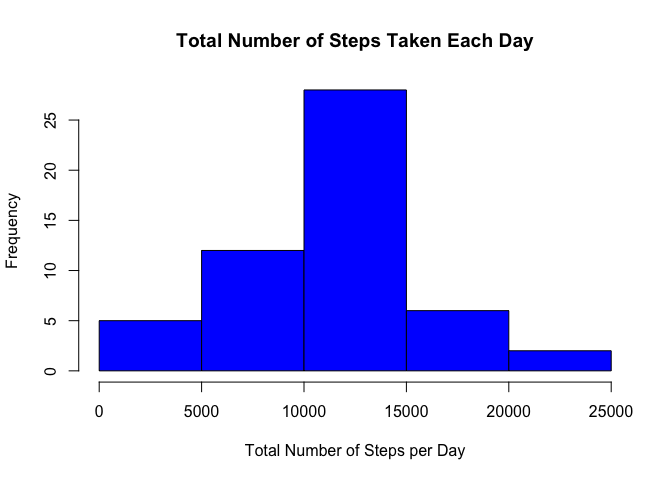
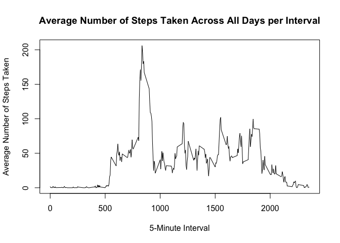
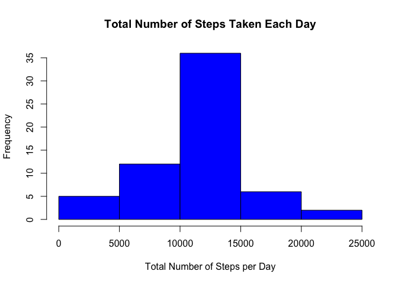
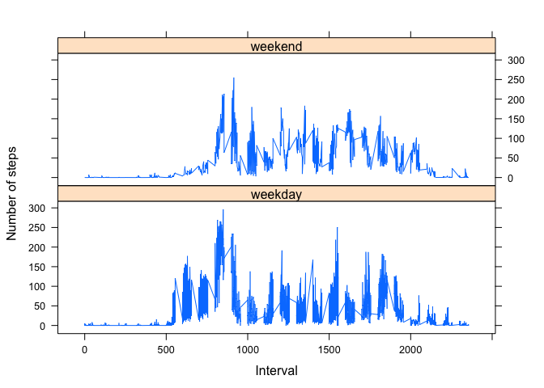

# Reproducible Research: Peer Assessment 1
Amber Beasock  
18 December 2015  

----------------------------------------------------------------------------------

### Introduction

Download the dataset for this assignment to your working directory: [Activity monitoring data](https://d396qusza40orc.cloudfront.net/repdata%2Fdata%2Factivity.zip)

The variables included in this dataset are:

- **steps:** Number of steps taking in a 5-minute interval (missing alues are coded as NA)
- **date:** The date on which the measurement was taken in YYYY-MM-DD format
- **interval:** Identifier for the 5-minute interval in which measurement was taken

The dataset is stored in a comma-separated-value (CSV) file and there are a total of 17,568 observations in this dataset.

----------------------------------------------------------------------------------

### Loading and preprocessing the data

Load the data into R

```r
activity_all <- read.csv("activity.csv")
```

----------------------------------------------------------------------------------

### What is mean total number of steps taken per day?

For this part of the assignment, you can ignore the missing values in the dataset.

```r
## Remove rows with missing values
activity <- na.omit(activity_all)
```

1. Calculate the total number of steps taken per day

```r
total_steps <- aggregate(steps ~ date, activity, sum)
```

2. Make a histogram of the total number of steps taken each day

```r
hist(total_steps$steps, xlab="Total Number of Steps per Day", main="Total Number of Steps Taken Each Day", col="blue")
```

 

3. Calculate and report the mean and median of the total number of steps taken per day

```r
## The mean of the total number steps taken per day
mean(total_steps$steps)
```

```
## [1] 10766.19
```

```r
## The median of the total number steps taken per day
median(total_steps$steps)
```

```
## [1] 10765
```

----------------------------------------------------------------------------------

### What is the average daily activity pattern?

1. Make a time series plot (i.e. `type = "l"`) of the 5-minute interval (x-axis) and the average number of steps taken, averaged across all days (y-axis)

```r
## First, calculate the average number of steps taken per 5-minute interval averaged across all days
interval_steps <- aggregate(steps ~ interval, activity, FUN="mean")

## Second, generate a time series plot
plot(interval_steps$interval, interval_steps$steps, type="l", ylab="Average Number of Steps Taken", xlab="5-Minute Interval", main="Average Number of Steps Taken Across All Days per Interval")
```

 

2. Which 5-minute interval, on average across all the days in the dataset, contains the maximum number of steps?


```r
interval_steps[which.max(interval_steps$steps),]
```

```
##     interval    steps
## 104      835 206.1698
```

----------------------------------------------------------------------------------

### Imputing missing values
Note that there are a number of days/intervals where there are missing values (coded as `NA`). The presence of missing days may introduce bias into some calculations or summaries of the data.

1. Calculate and report the total number of missing values in the dataset (i.e. the total number of rows with NAs)


```r
sum(is.na(activity_all$steps))
```

```
## [1] 2304
```

2. Devise a strategy for filling in all of the missing values in the dataset. The strategy does not need to be sophisticated. For example, you could use the mean/median for that day, or the mean for that 5-minute interval, etc.

The missing values will be filled in with mean for that 5-minute interval. The original data set with the missing values is stored in `activity_all` and the average number of steps per interval is stored in the data set `interval_steps`

3. Create a new dataset that is equal to the original dataset but with the missing data filled in.


```r
## Create a new dataset from original dataset the with missing value
clean_data <- activity_all

## Replace missing values with the mean for that 5-minute interval that was calculated in the 'interval_steps' dataset
for (i in 1:nrow(clean_data)){
    if (is.na(clean_data$steps[i])) {
        for (j in 1:nrow(interval_steps)){
            if (as.character(clean_data$interval[i]) == as.character(interval_steps$interval[j]))
                clean_data$steps[i] <- interval_steps$steps[j]
        }
    }
}
```

4. Make a histogram of the total number of steps taken each day and calculate and report the mean and median total number of steps taken per day. Do these values differ from the estimates from the first part of the assignment? What is the impact of imputing missing data on the estimates of the total daily number of steps?

```r
## Calculate the average number of steps taken each day from the new data set with the imputed values
clean_data_sum <- aggregate(steps ~ date, clean_data, sum)
## Create a histogram of the new data
hist(clean_data_sum$steps, xlab="Total Number of Steps per Day", main="Total Number of Steps Taken Each Day", col="blue")
```

 

```r
## Mean and median of the new data set
mean(clean_data_sum$steps)
```

```
## [1] 10766.19
```

```r
median(clean_data_sum$steps)
```

```
## [1] 10766.19
```
The mean does not differ and the median differs only slightly from the data set created earlier in the assignment with missing values removed. Imputing missing values with the mean for that 5-minute interval has very little statistical significance.

----------------------------------------------------------------------------------

### Are there differences in activity patterns between weekdays and weekends?

Use the dataset with the filled-in missing values for this part (`clean_data`).

1. Create a new factor variable in the dataset with two levels – “weekday” and “weekend” indicating whether a given date is a weekday or weekend day.


```r
## First, covert the date variable from factor to date, use the weekday() function to obtain the day of the week and put this  into a new variable
clean_data$days <- weekdays(as.Date(clean_data$date))
## Second, create the two levels
for (i in 1:length(clean_data$days)){
    if((clean_data$days[i] == 'Saturday') | (clean_data$days[i] == 'Sunday')){
    clean_data$weekday[i] <- 'weekend'} else {clean_data$weekday[i] <- 'weekday'}     
}
clean_data$weekday <- as.factor(clean_data$weekday)
```


2. Make a panel plot containing a time series plot (i.e. `type = "l"`) of the 5-minute interval (x-axis) and the average number of steps taken, averaged across all weekday days or weekend days (y-axis).


```r
## First, calculate the average number of steps taken per 5-minute interval averaged across all day types
weekdays_means <- aggregate(clean_data$steps, by=list(clean_data$days, clean_data$weekday, clean_data$interval), FUN="mean")
## Rename columns to descriptive names
names(weekdays_means) <- c('days','weekday','interval','mean')
## Time series plot generated using lattice
library(lattice)
xyplot(mean ~ interval | weekday, weekdays_means, 
        type="l", 
        lwd=1, 
        xlab="Interval", 
        ylab="Number of steps", 
        layout=c(1,2))
```

 

----------------------------------------------------------------------------------
