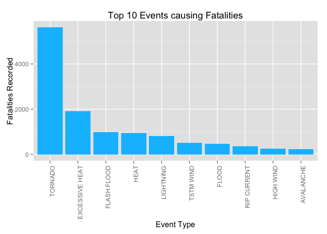
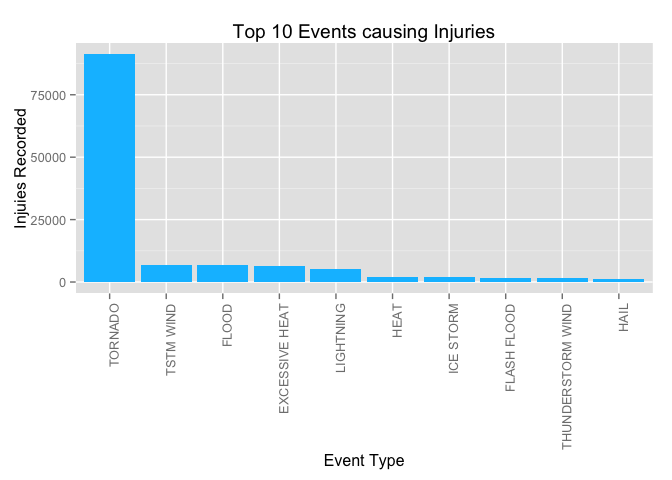
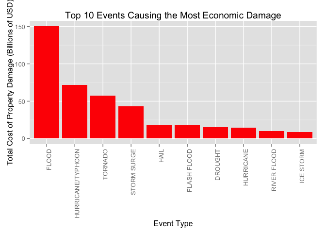

# Reproducible Research: Peer Assessment 2
Amber Beasock  
27 December 2015  

----------------------------------------------------------------------------------

## The Impact of Severe Weather Events on the Economy and Human Health

### Synopsis

This assignment involves using R to analyze the U.S. National Oceanic and Atmosphere Administration's (NOAA) storm database to answer some basic questions about severe weather events. The events in the dataset occured between the years 1950 and 2011. The data analysis aims to answer the following questions:

1. Across the United States, which types of events (as indicated in the `EVTYPE` variable) are most harmful with respect to population health?

2. Across the United States, which types of events have the greatest economic consequences?
    
----------------------------------------------------------------------------------

### Data Processing

The data for this assignment came in the form of a comma-separated-value file compressed via the bzip2 algorithm to reduce its size. The data can be downloaded at the course website: [Storm Data](https://d396qusza40orc.cloudfront.net/repdata%2Fdata%2FStormData.csv.bz2) [47Mb]

There is also some documentation of the database available. In these, you will find how some of the variables are constructed/defined.

- National Weather Service [Storm Data Documentation](https://d396qusza40orc.cloudfront.net/repdata%2Fpeer2_doc%2Fpd01016005curr.pdf)
- National Climatic Data Center Storm Events [FAQ](https://d396qusza40orc.cloudfront.net/repdata%2Fpeer2_doc%2FNCDC%20Storm%20Events-FAQ%20Page.pdf)
    

```r
# Packages used for analysis
library(R.utils)
library(ggplot2)
library(dplyr)
```

**Download & Load the data into R**

```r
# The location where the data is to be downloaded from
url <- "https://d396qusza40orc.cloudfront.net/repdata%2Fdata%2FStormData.csv.bz2"

# Download the data in your working directory
download.file(url, destfile="storm_data.csv.bz2", method="curl")

# To unzip the bz2 file you'll need to have `R.utils` package installed
# Unzip the bz2 file to get a CSV file
bunzip2("storm_data.csv.bz2", "storm_data.csv", remove = FALSE, overwrite=TRUE)

# Read the CSV file into R
storm_data <- read.csv("storm_data.csv")
```


```r
# To see how many observations and variables are in the dataset
dim(storm_data)
```

```
## [1] 902297     37
```


```r
# Reducing the dataset to only the needed variables 
data <- storm_data[,c("STATE", "EVTYPE", "FATALITIES", "INJURIES", "PROPDMG", "PROPDMGEXP", "CROPDMG", "CROPDMGEXP")]
```

---------------------------------------------------------------------------------- 

### Results

**First, we analyze which types of events (as indicated in the `EVTYPE` variable) across the United States are most harmful with respect to population health?**
 

```r
# Find the sum of fatalities per event
fatalities <- aggregate(FATALITIES ~ EVTYPE, data, sum)

# Take the top 10 events with the most fatalities
topFatalities <- arrange(fatalities, desc(FATALITIES)) [1:10,]

# Find the sum of injuries per event
injuries <- aggregate(INJURIES ~ EVTYPE, data, sum)

# Take the top 10 events with the most injuries
topInjuries <- arrange(injuries, desc(INJURIES)) [1:10,]
```

**Top 10 Events with the most Fatalities**

```r
print(topFatalities)
```

```
##            EVTYPE FATALITIES
## 1         TORNADO       5633
## 2  EXCESSIVE HEAT       1903
## 3     FLASH FLOOD        978
## 4            HEAT        937
## 5       LIGHTNING        816
## 6       TSTM WIND        504
## 7           FLOOD        470
## 8     RIP CURRENT        368
## 9       HIGH WIND        248
## 10      AVALANCHE        224
```


```r
topFatalities <- transform(topFatalities,EVTYPE=reorder(EVTYPE, order(FATALITIES, decreasing=TRUE)))

# Order by decreasing number of fatalities for graphing
ggplot(aes(x=EVTYPE, y=FATALITIES),data=topFatalities) +
    geom_bar(stat="identity", fill= "deepskyblue") +
    xlab("Event Type") +
    ylab("Fatalities Recorded") +
    ggtitle("Top 10 Events causing Fatalities") +
    theme(axis.text.x = element_text(angle = 90, hjust = 1))
```

 

**Top 10 Events with the most Injuries**

```r
print(topInjuries)
```

```
##               EVTYPE INJURIES
## 1            TORNADO    91346
## 2          TSTM WIND     6957
## 3              FLOOD     6789
## 4     EXCESSIVE HEAT     6525
## 5          LIGHTNING     5230
## 6               HEAT     2100
## 7          ICE STORM     1975
## 8        FLASH FLOOD     1777
## 9  THUNDERSTORM WIND     1488
## 10              HAIL     1361
```


```r
# Order by decreasing number of injuries for graphing
topInjuries <- transform(topInjuries,EVTYPE=reorder(EVTYPE, order(INJURIES, decreasing=TRUE)))

ggplot(aes(x=EVTYPE, y=INJURIES),data=topInjuries) +
    geom_bar(stat="identity", fill= "deepskyblue") +
    xlab("Event Type") +
    ylab("Injuies Recorded") +
    ggtitle("Top 10 Events causing Injuries") +
    theme(axis.text.x = element_text(angle = 90, hjust = 1))
```

 

The top weather event to cause both the most fatalities and injuries was tornados.

**Secondly, we analysis which types of events across the United States have the greatest economic consequences?**

The property damage estimates reported in the variable `PROPDMG` are rounded to three significant digits, followed by an alphabetical character signifying the magnitude of the number, i.e., 1.55B for $1,550,000,000. Alphabetical characters used to signify magnitude include “K” for thousands, “M” for millions, and “B” for billions are reported in the variable `PROPDMGEXP`.


```r
# Multiply the damage amounts based on the amount indicated by the alphabetical character in `PROPDMGEXP`.  
data$PROP_Total <- 0
data[data$PROPDMGEXP %in% c("H","h"),"PROP_Total"] <- data[data$PROPDMGEXP %in% c("H","h"),"PROPDMG"] * 100
data[data$PROPDMGEXP %in% c("K","k"),"PROP_Total"] <- data[data$PROPDMGEXP %in% c("K","k"),"PROPDMG"] * 1000
data[data$PROPDMGEXP %in% c("M","m"),"PROP_Total"] <- data[data$PROPDMGEXP %in% c("M","m"),"PROPDMG"] * 1000000
data[data$PROPDMGEXP %in% c("B","b"),"PROP_Total"] <- data[data$PROPDMGEXP %in% c("B","b"),"PROPDMG"] * 1000000000

# Multiply the damage amounts based on the amount indicated by the alphabetical character in `CROPDMGEXP`.  
data$CROP_Total <- 0
data[data$CROPDMGEXP %in% c("H","h"),"CROP_Total"] <- data[data$CROPDMGEXP %in% c("H","h"),"CROPDMG"] * 100
data[data$CROPDMGEXP %in% c("K","k"),"CROP_Total"] <- data[data$CROPDMGEXP %in% c("K","k"),"CROPDMG"] * 1000
data[data$CROPDMGEXP %in% c("M","m"),"CROP_Total"] <- data[data$CROPDMGEXP %in% c("M","m"),"CROPDMG"] * 1000000
data[data$CROPDMGEXP %in% c("B","b"),"CROP_Total"] <- data[data$CROPDMGEXP %in% c("B","b"),"CROPDMG"] * 1000000000

# Property and crop damage costs are summed together to investigate the total economic damage produced.
data$damage <- data$PROP_Total + data$CROP_Total

# Find the sum of property damage per event
damage_total <- aggregate(damage ~ EVTYPE, data, sum)

# Take the top 10 events with the largest monetary amount of damage
top_damage <- arrange(damage_total, desc(damage)) [1:10,]

top_damage$damage <-top_damage$damage*1e-9
```

**Top 10 Events with the most economic damage**

```r
print(top_damage)
```

```
##               EVTYPE     damage
## 1              FLOOD 150.319678
## 2  HURRICANE/TYPHOON  71.913713
## 3            TORNADO  57.352114
## 4        STORM SURGE  43.323541
## 5               HAIL  18.758222
## 6        FLASH FLOOD  17.562129
## 7            DROUGHT  15.018672
## 8          HURRICANE  14.610229
## 9        RIVER FLOOD  10.148404
## 10         ICE STORM   8.967041
```


```r
# Order by decreasing amount of property damage for graphing
top_damage <- transform(top_damage,EVTYPE=reorder(EVTYPE, order(damage, decreasing=TRUE)))

ggplot(aes(x=EVTYPE, y=damage),data=top_damage) +
    geom_bar(stat="identity", fill= "red") +
    xlab("Event Type") +
    ylab("Total Cost of Property Damage (Billions of USD)") +
    ggtitle("Top 10 Events Causing the Most Economic Damage") +
    theme(axis.text.x = element_text(angle = 90, hjust = 1))
```

 

The top weather event to cause the most economic damage was floods.

---------------------------------------------------------------------------------- 

### Conclusion

Tornados caused significantly more injuries and fatalities than any other severe weather events. Economic damaged was analyzed by looking at both property and crop damage. Floods caused significantly more economic damage that other severe weather events.
